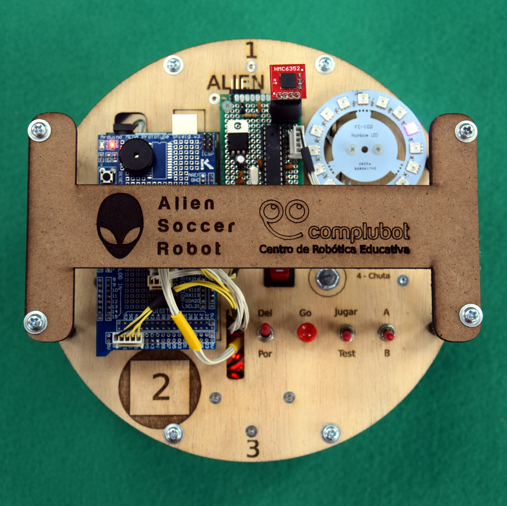
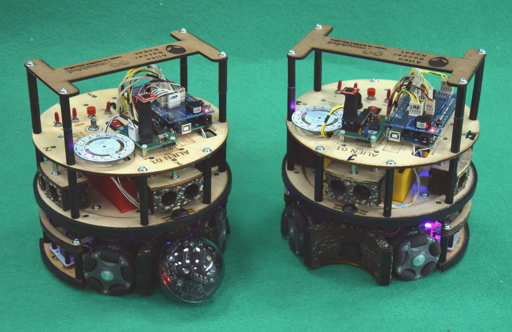
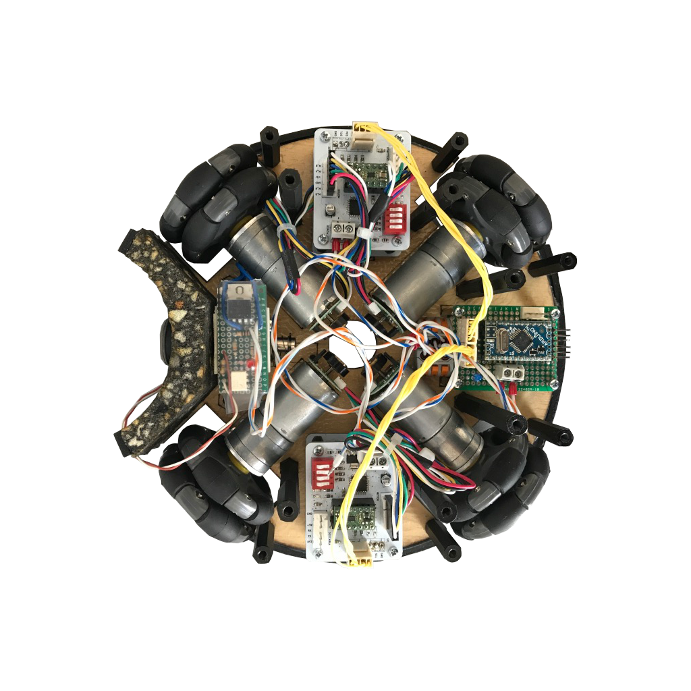
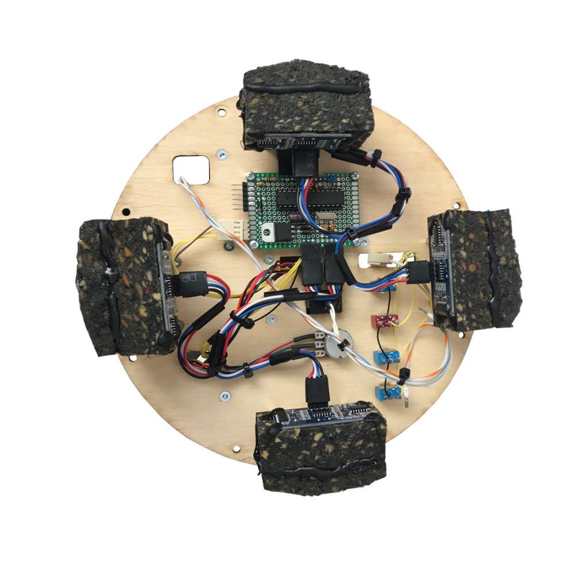
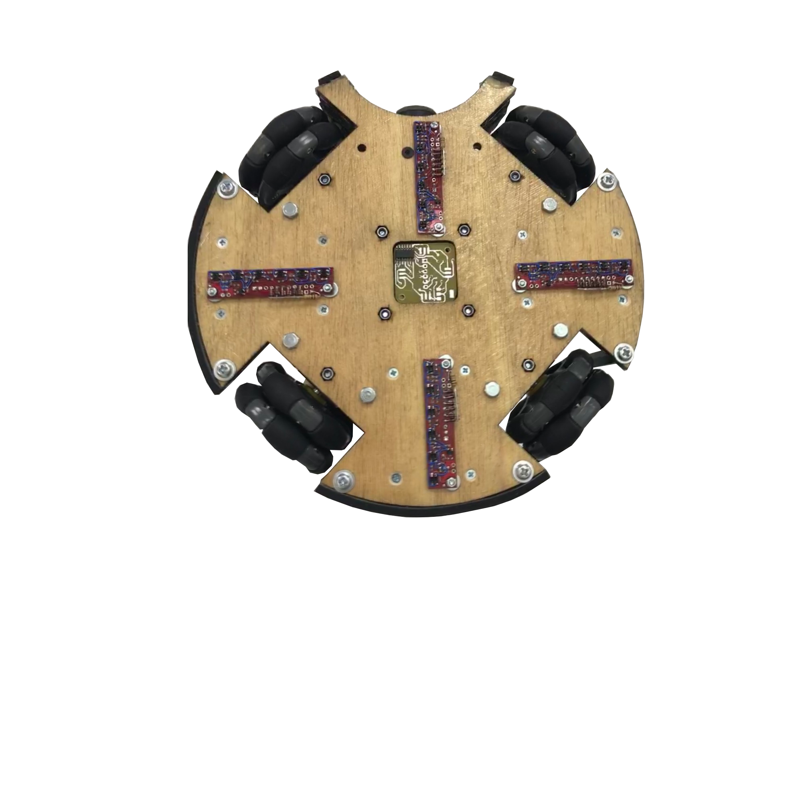
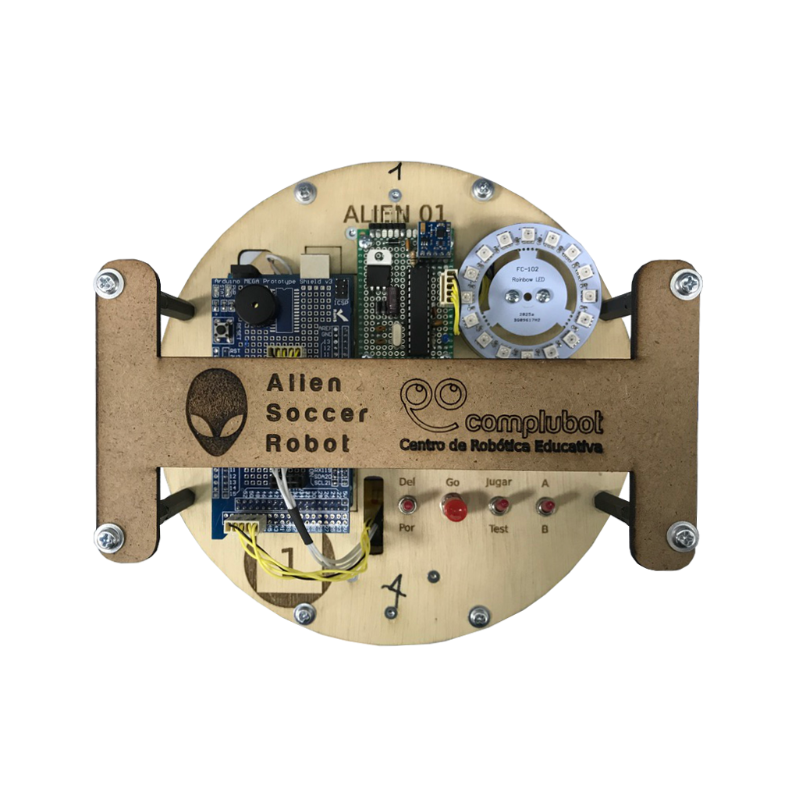
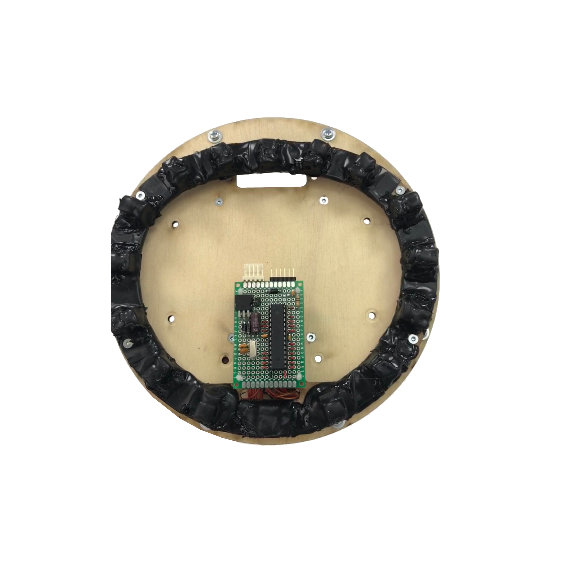
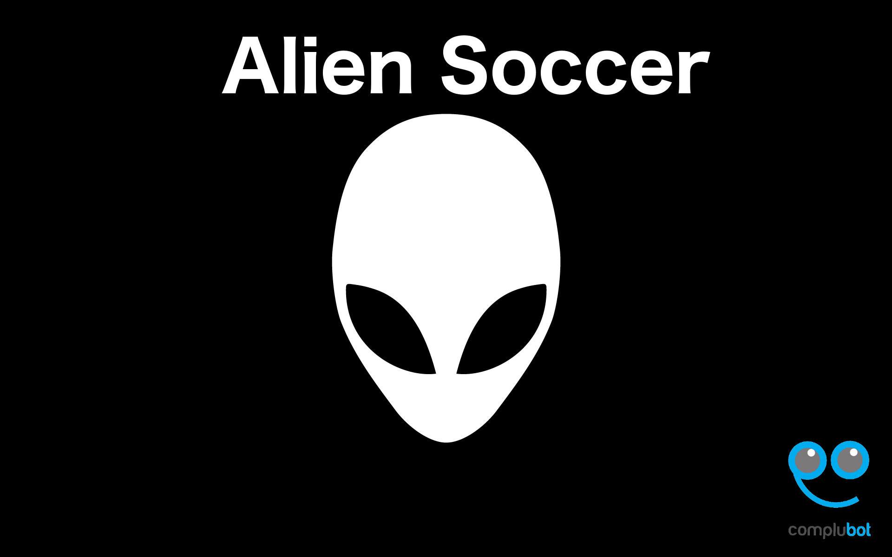

# AlienSoccer

This project was made by a team of three students that I was part of at Complubot.

We built two robots that played soccer coordinately with a ball that emited infrared light.
The robots were able to detect the ball as well as recognize certain parts of the field like the white limitational lines on it that the robots couldn't cross. Also they detected the field's walls as well as each other using ultrasounds.
Both robots where identically built and the operated with the same software, anyway we had different game modes like goalkeeper or player to modify their behavior.

[View in prezi (Spanish)](https://prezi.com/view/UruUJdG32kYzkdQXmuUq "prezi")

## Main caracteristics
* **High modularity:** the robots had eight processors distributed along them, each one was in charge of a specific task, making every part of the robot independent of the others. We detected wich parts where connected to the robot and operate eith them. Also one independant part could make all its functionality without the others. This made much easier the building procces because we could work in multiple parts of the robot at the same time, also testing them was faster. If one part was damaged during a game we could replace it completely with a new one in less than a minute, also the same part could operate in any robot.
* **Friendly interface:** the robots had a set of buttons, a cirular array of leds and a speaker so at any moment we could be displaying whatever the robots were seeing by their sensors. Having a nice interface was critical mainly because it made testing much easier and faster.
* **Fast processing:** We had had eight Arduino processors distributed along each robot so we where doing hadrware parallelism at any time, the robots could reach a max cycle of sensor refresing of 50ms including processing the information, and decision making.

## Parts of the robots
* **Compass:** The robots could know where they were facing to target the enemy goal.
* **Ultrasounds:** The robots could measure distances of the walls and detect objects.
* **Ball sensor:** Each robot had a "donut" of sensor arroun it, the function of this "donut" was to determine the possition and distance of the ball.
* **UI:** thanks to a set of buttons, a speaker and a circular array of leds we could "talk" to the robot.
* **Floor sensors:** We had four arrays of six sensors each that could read the wite lines of the field.
* **Motors:** Along with the ball sensors this was one of the critical parts of the robot. The robots had for motor each disposed in an X form to make an omnidirectional platform. Each motor was ruled by one proccesor wich made PID control to the motor, the four motor processors were ruled by another one wich made PID control with the facing possition and the ball position and distance to decide the target velocities of the motors, the processors comunicated by i2c.
* **Main board:** we had an arduino Mega as master of all the other seven processors, here the robots made the most critical decissions.

[Mr.BlissfulGrin](http://www.mrblissfulgrin.com "mrblissfulgrin")

[Complubot](http://complubot.com/inicio/ "complubot")

## Promotional video
 
**Share the video with:** [https://youtu.be/aCtYLtXQVko](https://youtu.be/aCtYLtXQVko "https://youtu.be/aCtYLtXQVko")

## Fist tests

**Share the video with:** [https://youtu.be/rDMKiselTD4](https://youtu.be/rDMKiselTD4 "https://youtu.be/rDMKiselTD4")

## Images

